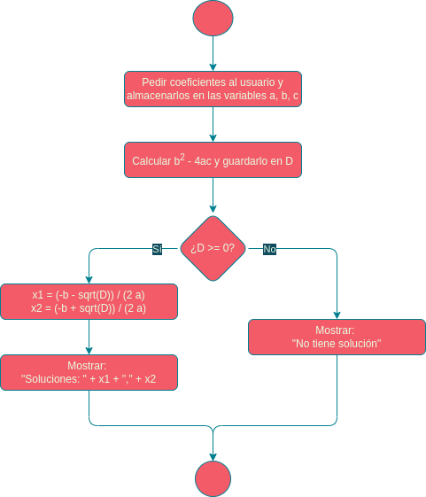
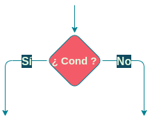
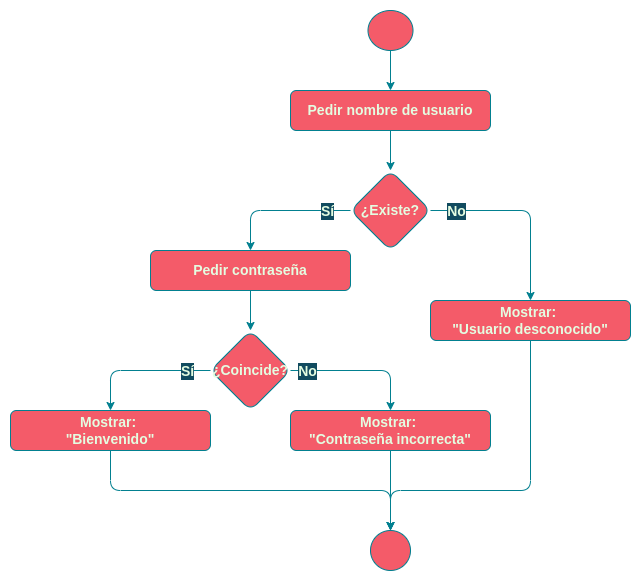

# Diagrama de flujo

Un **diagrama de flujo** es la representación gráfica del flujo de ejecución de un programa.

Por ejemplo:

# Símbolos

Los símbolos usados en los diagramas de flujo son los siguientes:

|      | Inicio/fin  |
|   | Sentencias  |
|  | Bifurcación |

# Ejemplo

Programa que pide al usuario su nombre, comprueba si existe, y luego pide la contraseña, y comprueba si es correcta:

Ejecuta el programa en la consola para observar su funcionamiento.
