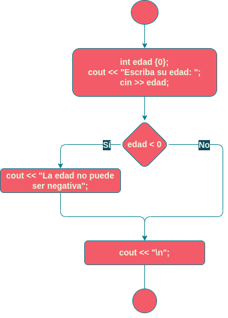
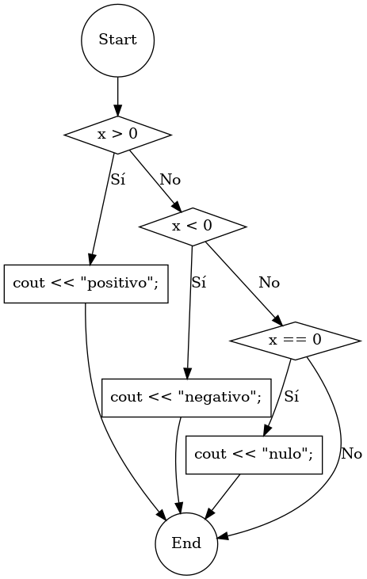
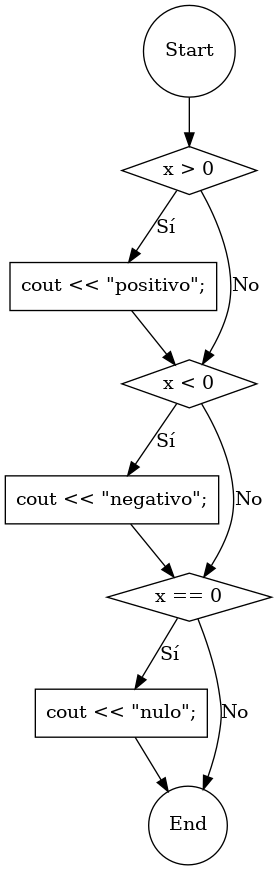
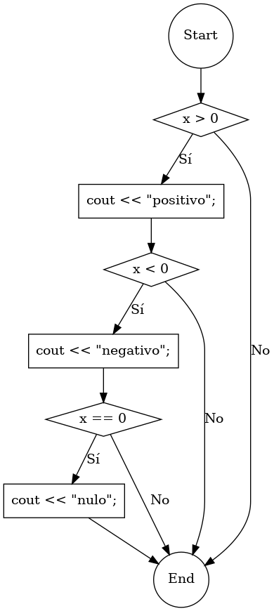
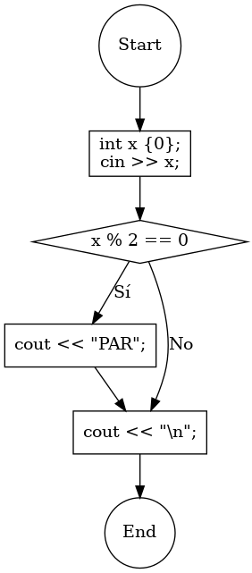

# Sentencia `if`

Sentencia que comprueba si se cumple una condición. Si se cumple, ejecuta un bloque de sentencias. Si no, no lo ejecuta.


# Sintaxis

```C++
if (condición)
{
    sentencia1;
    sentencia2;
    ...
}
```


# Ejemplo

```C++
#include "ticlib.h"

using namespace std;

int main()
{
    int edad {0};
    cout << "Escriba su edad: ";
    cin >> edad;
    if (edad < 0)
    {
        cout << "La edad no puede ser negativa";
    }
    cout << "\n";
}
```




# Ejercicios

1.  Dibuja el diagrama de flujo correspondiente al código siguiente:
    
    ```C++
    if (x > 0)
    {
        cout << "positivo\n";
    }
    if (x < 0)
    {
        cout << "negativo";
    }
    if (x == 0)
    {
        cout << "nulo";
    }
    ```
    
    Opción a:
    
    
    
    Opción b:
    
    
    
    Opción c:
    
    

1.  Escribe el código correspondiente al siguiente diagrama de flujo:
    
    
