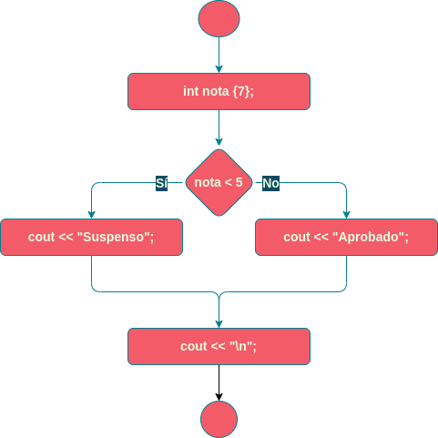
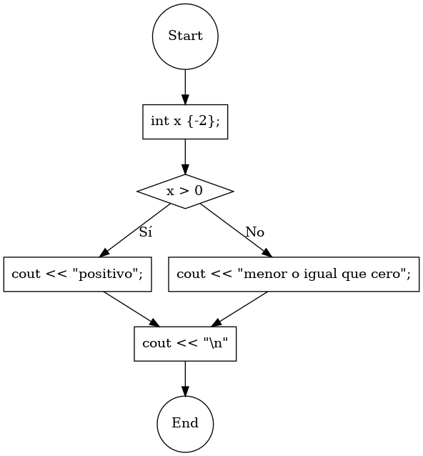
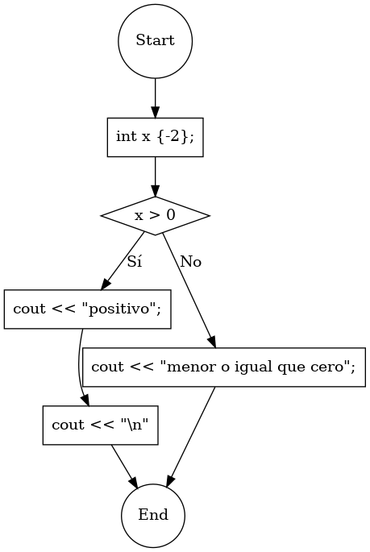
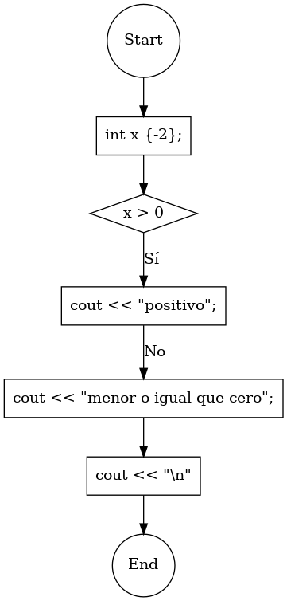
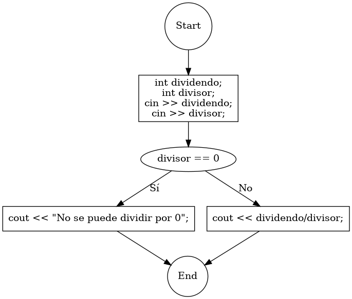

# Sentencia `if/else`

Sentencia que comprueba si se cumple una condición. Si se cumple, ejecuta un bloque de sentencias. Si no se cumple, ejecuta otro bloque de sentencias distinto.


# Sintaxis

```C++
if (condición)
{
    sentencias_si_se_cumple;
}
else
{
    sentencias_si_NO_se_cumple;
}
```


# Ejemplo

```C++
cout << "¿Cuál es su nota? ";
int nota;
cin >> nota;
if (nota < 5)
{
    cout << "Supenso";
}
else
{
    cout << "Aprobado";
}
cout << "\n";
```




# Ejercicios

1.  Elige el diagrama de flujo correspondiente al siguiente código:
    
    ```C++
    if (x > 0)
    {
        cout << "positivo";
    }
    else
    {
        cout << "menor o igual que cero";
    }
    ```
    
    Opción a:
    
    
    
    Opción b:
    
    
    
    Opción c:
    
    

2.  Escribe el código correspondiente al siguiente diagrama de flujo:
    
    
    
3. 
