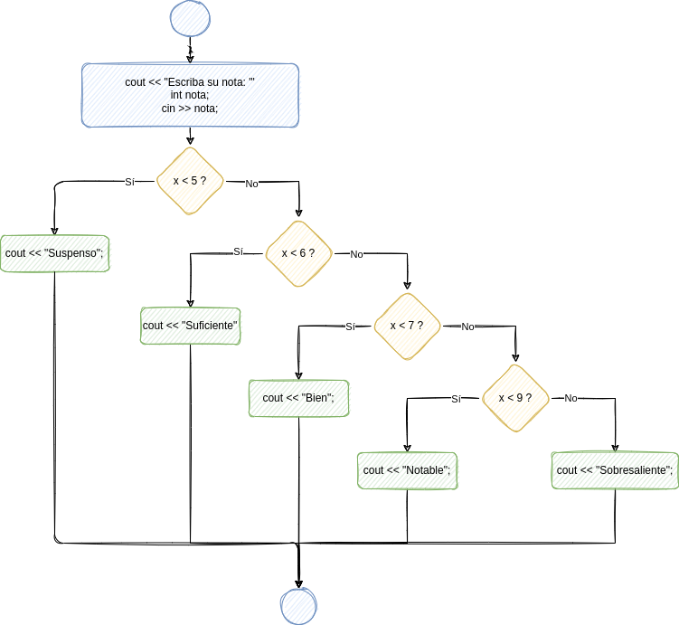
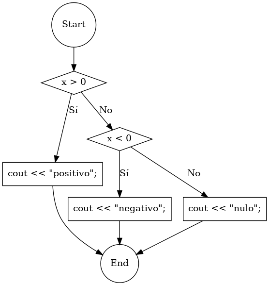
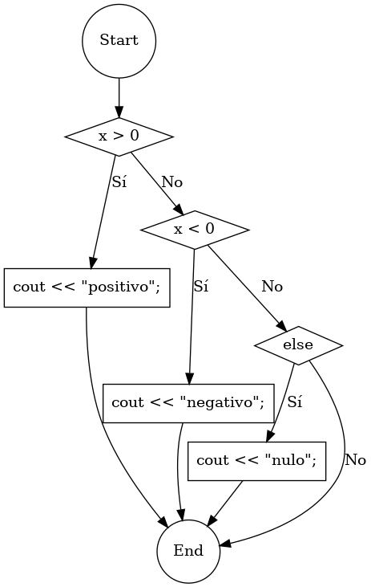
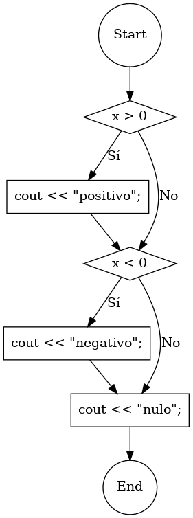
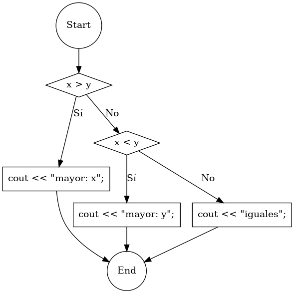

# Varias condiciones

Si queremos comprobar varias condiciones, podemos usar la construcción `if/else if/else`. Se comprueba una condición. Si se cumple, se ejecuta el bloque de sentencias correspondiente. Si no se cumple, se comprueba otra condición: la que sigue a `else if`. Si esta segunda se cumple, se ejecuta el siguiente bloque de sentencias. Se pueden repetir más sentencias `else if`. Si al final, hay una sentencia `else`, en caso de que no se haya cumplido ninguna de las condiciones, se ejecutará el bloque de sentencias que sigue a `else`.


# Sintaxis

```C++
if (condición1)
{
    sentencias_si_se_cumple_cond_1;
}
else if (condición2)
{
    sentencias_si_no_se_cumple_cond_1_pero_se_cumple_cond_2;
}
else if (condición3)
{
    sentencias_si_no_se_cumplen_cond_1_ni_cond_2_pero_se_cumple_cond_3;
}
else
{
    sentencias_si_no_se_cumple_ninguna;
}
```


# Ejemplo

```C++
#include "ticlib.h"

using namespace std;

int main()
{
    cout << "Escriba su nota: ";
    int nota;
    cin >> nota;
    if (nota < 5)
    {
        cout << "Suspenso";
    }
    else if (nota < 6)
    {
        cout << "Suficiente";
    }
    else if (nota < 7)
    {
        cout << "Bien";
    }
    else if (nota < 9)
    {
        cout << "Notable";
    }
    else {
        cout << "Sobresaliente";
    }
    cout << "\n";
}
```



Observa la diferencia entre usar o no `else if`:

```C++
#include "ticlib.h"

using namespace std;

int main()
{
    cout << "Nota? ";
    int nota;
    cin >> nota;
    if (nota < 5)
    {
        cout << "Bajo\n";
    }
    else if (nota < 7)
    {
        cout << "Medio\n";
    }
    else
    {
        cout << "Alto\n";
    }
}
```

```C++
#include "ticlib.h"

using namespace std;

int main()
{
    cout << "Nota? ";
    int nota;
    cin >> nota;
    if (nota < 5)
    {
        cout << "Bajo\n";
    }
    if (nota < 7)
    {
        cout << "Medio\n";
    }
    if (nota <= 10)
    {
        cout << "Alto\n";
    }
}
```


# Ejercicios

1.  Elige el diagrama de flujo correspondiente al siguiente código:
    
    ```C++
    if (x > 0)
    {
        cout << "positivo";
    }
    else if (x < 0)
    {
        cout << "negativo";
    }
    else {
        cout << "nulo";
    }
    ```
    
    Opción a:
    
    
    
    Opción b:
    
    
    
    Opción c:
    
    

2.  Escribe el código correspondiente al siguiente diagrama de flujo:
    
    
